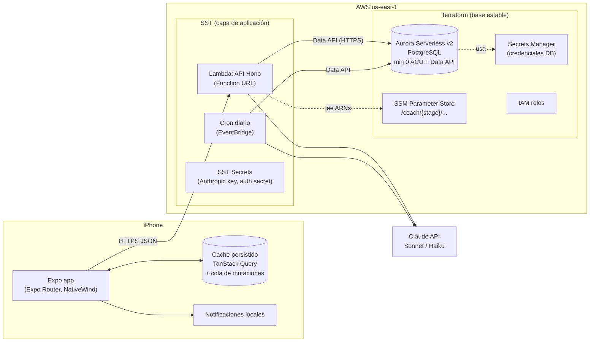
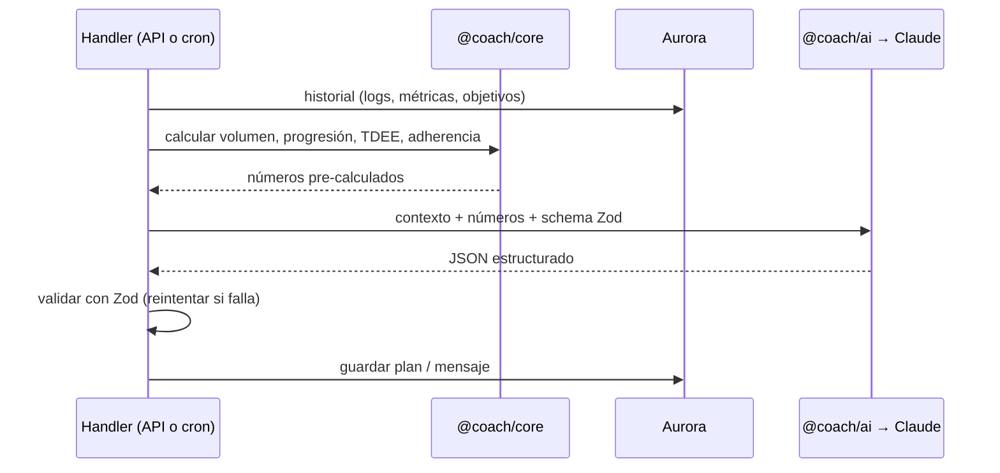

# Arquitectura

> Documento vivo. Describe **cómo** está construido coach-app y **por qué**.
> Si una decisión cambia, se actualiza aquí en el mismo PR que la implementa.

## 1. Visión general

coach-app es un entrenador personal con IA para ~5 usuarios (iPhone). La app móvil es la fuente principal de interacción; el backend guarda los datos, calcula métricas y le pide a Claude las decisiones de coaching.

Principio rector: **el código calcula, la IA decide.**

| Responsabilidad | Quién | Ejemplos |
|---|---|---|
| Cálculos deterministas | `packages/core` (TypeScript puro, con tests) | Progresión de carga (doble progresión), volumen semanal, TDEE, calorías, macros, adherencia |
| Decisiones y lenguaje | Claude vía `packages/ai` | "Saltaste piernas dos veces: bajo el volumen y muevo la sesión al sábado", mensaje diario, estimación de macros de una comida |
| Validación | Zod (compartido) | Toda salida de la IA se valida contra un schema antes de guardarse |

La IA **nunca** devuelve texto libre que el sistema tenga que interpretar: siempre JSON estructurado (plan semanal, ajustes, macros) que se valida con Zod.

## 2. Diagrama de componentes

## 3. Componentes

### 3.1 App móvil — `apps/mobile`

- **Expo + Expo Router** (navegación por archivos). Nativa desde el día 1: logging offline, temporizador de descanso fiable, HealthKit más adelante. Expo también puede generar web.
- **UI:** NativeWind (Tailwind para React Native) + react-native-reusables (componentes estilo shadcn/ui).
- **Offline-first:** TanStack Query con cache persistido y **mutaciones en cola**. El usuario registra series sin esperar al servidor; la cola se sincroniza cuando hay red. Esto también oculta el arranque en frío de Aurora (~15 s).
- **Notificaciones:** locales, programadas por la propia app (rutina por la mañana, recordatorio por la tarde si no se registró nada). Funcionan sin cuenta de Apple de pago. Push desde servidor (Expo push) llega en la fase 4.
- **Auth:** cliente Expo de Better Auth; sesión guardada en SecureStore.

### 3.2 API — `apps/api`

- **Hono** sobre AWS Lambda, expuesta con una **Function URL** (sin API Gateway: más simple y gratis).
- Rutas validadas con Zod (los mismos schemas de `packages/core`).
- Better Auth montado en `/api/auth/*`.
- Ejecuta **fuera de la VPC**: habla con Aurora por la **Data API** (HTTPS), así que no hay NAT Gateway ni IPv4 públicas que pagar.

### 3.3 Paquetes compartidos — `packages/*`

| Paquete | Contenido | Depende de |
|---|---|---|
| `@coach/core` | Lógica de dominio pura + schemas Zod. Sin I/O. Cobertura de tests alta | `zod` |
| `@coach/db` | Schema Drizzle, migraciones (drizzle-kit), cliente Data API | `@coach/core` |
| `@coach/ai` | Prompts, llamadas a Claude con Vercel AI SDK (`generateObject` + schema Zod) | `@coach/core` |
| `@coach/functions` | Handlers del cron (revisión del plan, mensaje diario) | `core`, `db`, `ai` |

### 3.4 Base de datos

- **Aurora Serverless v2 (PostgreSQL)** con `min_capacity = 0` → se pausa sola cuando no hay uso y cuesta casi solo el almacenamiento.
- **Data API** activada: consultas por HTTPS con IAM, sin conexiones TCP ni VPC en las Lambdas.
- **Drizzle ORM** con el driver `drizzle-orm/aws-data-api/pg`; migraciones con drizzle-kit.
- Convención: tablas en plural y `snake_case` (`workout_logs.performed_at`).
- **Arranque en frío:** reanudar desde 0 ACU tarda ~15 s y la Data API puede fallar mientras tanto → reintentos con backoff en el cliente de DB; el cron "despierta" la DB un par de minutos antes de generar planes.

Modelo de datos inicial (se diseña en detalle al empezar la fase 1): `users`, `goals`, `body_metrics`, `exercises`, `training_plans`, `planned_workouts`, `planned_sets`, `workout_logs`, `set_logs`, `meals` (+ tablas propias de Better Auth).

### 3.5 IA — `packages/ai`

| Tarea | Modelo | Cuándo |
|---|---|---|
| Generar el plan semanal | Sonnet | Onboarding y revisión semanal |
| Revisar/ajustar el plan | Sonnet | Cron semanal (o cuando la adherencia cae) |
| Mensaje diario | Haiku | Cron diario |
| Estimar macros de una comida | Haiku | Al registrar una comida (±15–20 % es aceptable) |

Flujo de una llamada:

## 4. Infraestructura: Terraform + SST

Cada herramienta es dueña de sus recursos y **nunca** gestionan lo mismo.

| | Terraform (`infra/terraform/`) | SST (`sst.config.ts`) |
|---|---|---|
| Qué | La base estable, que cambia poco | La capa de aplicación, que cambia con cada feature |
| Recursos | Cluster Aurora, secreto de la DB, roles IAM, parámetros SSM | Lambda de la API + Function URL, cron, SST Secrets |
| Estado | S3 con locking nativo (`use_lockfile = true`, Terraform ≥ 1.10) | Bucket de estado propio que SST crea en la cuenta |
| Cómo se conectan | Publica ARNs/nombres en SSM (`/coach/{stage}/...`) | Lee esos valores de SSM al desplegar |

**¿Por qué dos herramientas?** Terraform es el estándar para infraestructura "pesada" y duradera (la DB no debería tocarse en cada deploy). SST está pensado para apps serverless en TypeScript: despliega Lambdas con hot-reload en desarrollo (`sst dev`) y gestiona secretos con poco código.

### Parámetros SSM previstos

| Parámetro | Valor |
|---|---|
| `/coach/{stage}/db/cluster-arn` | ARN del cluster Aurora |
| `/coach/{stage}/db/secret-arn` | ARN del secreto de credenciales |
| `/coach/{stage}/db/name` | Nombre de la base de datos |

### Nombres de recursos AWS

`coach-{stage}-{resource}`, por ejemplo `coach-prod-aurora`.

## 5. Entornos y ramas

| Rama git | Uso | Stage de despliegue |
|---|---|---|
| `feature/*`, `docs/*`, `fix/*`… | Trabajo de una tarea | local / `sst dev` |
| `dev` | Integración; rama por defecto | `dev` *(por decidir, ver todos.md)* |
| `prod` | Lo que está en uso real | `prod` |

Flujo: rama de tarea → PR a `dev` → cuando `dev` está estable, PR de `dev` a `prod`. `main` no se usa.

Los despliegues son **manuales** (`sst deploy --stage …`) y siempre con aprobación explícita. CI/CD queda como idea (ver `ideas.md`).

## 6. Seguridad

- Cuenta AWS: root con MFA y sin uso diario; usuario admin por IAM Identity Center; perfil local `coach`.
- Secretos **nunca** en git: credenciales de DB en Secrets Manager, claves de apps en SST Secrets o SSM.
- `*.tfstate` y `.terraform/` en `.gitignore` (el estado contiene secretos).
- Las Lambdas acceden a Aurora solo por Data API con permisos IAM mínimos (`rds-data:*` sobre el cluster + `secretsmanager:GetSecretValue` sobre ese secreto).
- La Function URL es pública; toda ruta salvo `/health` y `/api/auth/*` exige sesión válida.

## 7. Costes objetivo

| Concepto | USD/mes |
|---|---|
| Aurora Serverless v2 (~1–2 h activa/día) | ~2–5 |
| Lambda, EventBridge, SSM | ~0 (capa gratuita permanente) |
| NAT / IPv4 pública | 0 (no se usan) |
| Claude API | ~5–10 |
| **Total** | **~7–15** |
| Apple Developer Program | 99 USD/año, **solo en la fase 4** |

Alerta de AWS Budgets en 10 USD desde el día 1.

## 8. Registro de decisiones

| Fecha | Decisión | Motivo |
|---|---|---|
| 2026-09 | Yarn 4 con `nodeLinker: node-modules` | PnP rompe Expo/React Native |
| 2026-09 | Aurora Serverless v2 + Data API, Lambdas fuera de VPC | Escala a cero y sin coste de NAT |
| 2026-09 | Better Auth en vez de Cognito | Más simple, cliente Expo, datos en nuestra DB |
| 2026-09 | Terraform (base) + SST (app) | Base estable separada de despliegues frecuentes |
| 2026-09 | Notificaciones locales como vía principal | Funcionan sin cuenta de Apple de pago |
| 2026-09 | Ramas `dev` → `prod`, sin `main` | Flujo de integración y promoción explícito |
